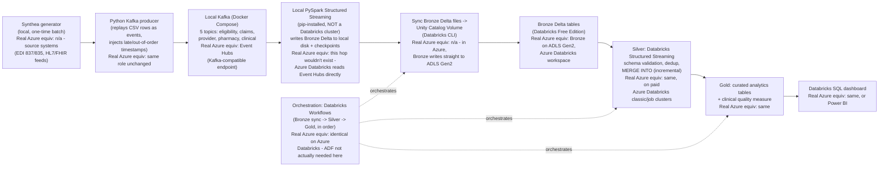

# Architecture

All data in this project is **synthetic**, generated locally with [Synthea](https://github.com/synthetichealth/synthea).
No real patient, member, claim, or provider data is used anywhere in this repository.

## Why these choices

This project is built entirely on free/local tooling as a stand-in for an Azure-based
production deployment. Two constraints drove the design, and both are worth understanding
rather than treating as trivia:

1. **Databricks Free Edition** (the current free tier - Community Edition was retired
   January 1, 2026) provides only serverless compute, with outbound network access
   restricted to a small set of trusted domains. There is no way to open a network path
   from a Free Edition notebook to an arbitrary external host, including a local Docker
   container.
2. Because of (1), the Kafka-consuming hop of this pipeline runs as **local PySpark
   Structured Streaming** (pip-installed, not a Databricks cluster). Everything from the
   Bronze->Silver hop onward runs as real Databricks Structured Streaming, reading Delta
   tables incrementally - which is itself a standard medallion-architecture pattern, not
   a workaround.

In a real Azure deployment, Bronze would stream directly from **Azure Event Hubs**
(a managed, publicly-reachable, Kafka-compatible endpoint) straight into **ADLS Gen2**,
with no local hop and no manual file sync required. That local-to-cloud sync step is the
single biggest divergence between this build and a real Azure deployment - see the
"real Azure equivalent" notes in the diagram below.

## Data flow

## Source domains

| Domain | Synthea file(s) | Notes |
|---|---|---|
| Eligibility | `payer_transitions.csv` | Effective-dated coverage periods (`Start_Year` / `End_Year`) |
| Claims | `claims.csv` + `claims_transactions.csv` | `claims_transactions.Type` carries CHARGE / PAYMENT / ADJUSTMENT / TRANSFER semantics |
| Provider | `providers.csv` (+ `organizations.csv`) | Provider directory, org affiliation |
| Pharmacy | `medications.csv` | Prescription fill events |
| Clinical | `conditions.csv`, `observations.csv`, `procedures.csv`, `encounters.csv` | Backing data for the Gold-layer clinical quality measure |
